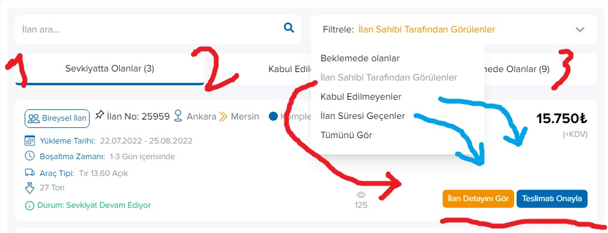

# Teklifler

**Gelen** ve **Giden** teklifler olmak üzere **iki adet** sayfa mevcuttur. İçlerinde üçer adet her iki sayfada birbirinin aynısı olacak şekilde tablar bulunur.

- Sevkiyatta olanlar
- Kabul edilenler olanlar
- Beklemede olanlar

Şeklinde üçer tabla bilrikte tablara ait filtreler yer almaktadır. Filtre ve tablara göre değişen butonları ve alınan aksiyonları aşağıdan inceleyebilirsiniz.

### GELEN TEKLİFLERİM 
#### Sevkiyatta Olanlar  
Butonlar: `görüntülenme`, `listeden kaldır`, `ilan detayını gör`, `Teslimatı onayla / Teklifleri İncele`
- Sevkiyatı Devam Edenler 

#### Kabul Edilenler 
Butonlar:  `görüntülenme`, `listeden kaldır`, `ilan detayını gör`, `Diğer Teklifleri İncele(3)`
- Sevkiyata Hazır Olanlar

#### Beklemede olanlar
Butonlar:  `görüntülenme`, `listeden kaldır`, `ilan detayını gör`, `Diğer Teklifleri İncele(0)`
- Teklif Bekleyenler
- Yanıt Bekleyenler
-Tümünü Göster

### GIDEN TEKLİFLERİM 

#### Sevkiyatta Olanlar 
Butonlar:  `görüntülenme`, `favorilere ekle`,`vazgeç`,
 `ilan detayını gör`, `Sevkiyatı Tamamla`
- Sevkiyatı Devam Edenler
- Teslimat Onayı Bekleyenler
- Sevkiyatı Tamamlananlar
- Tümünü Göster

#### Kabul Edilenler 
Butonlar:  `görüntülenme`, `favorilere ekle`,`vazgeç`,
 `ilan detayını gör`, `Sevkiyatı Başlat`
- Sevkiyata Hazır Olanlar

#### Beklemede olanlar
Butonlar:  `görüntülenme`, `favorilere ekle`,
 `ilan detayını gör`, `Teklifi Geri Al`
- Teklif Bekleyenler
- Yanıt Bekleyenler
- Tümünü Göster